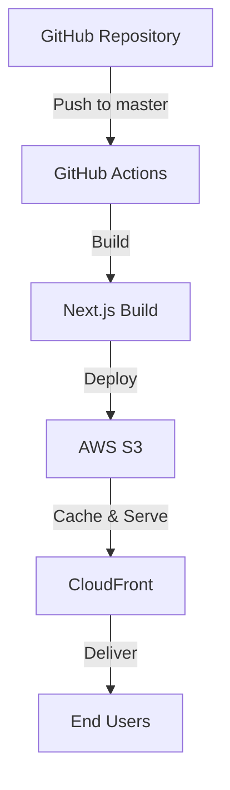

# 프론트엔드 배포 파이프라인

## 주요 링크

- S3 버킷 웹사이트 엔드포인트: http://hanghaepluschul.s3-website-ap-southeast-2.amazonaws.com/
- CloudFrount 배포 도메인 이름: https://dti51gjx2qf7q.cloudfront.net

## 배포 아키텍처

## 배포 인프라 구성

### AWS 서비스 구성

- **S3**

  - 정적 웹사이트 호스팅을 위한 스토리지
  - Next.js 빌드 결과물 저장
  - 버킷 정책으로 CloudFront 접근 허용

- **CloudFront**

  - CDN을 통한 전역 콘텐츠 전송
  - HTTPS 보안 연결 제공
  - 캐싱을 통한 성능 최적화

- **IAM**
  - GitHub Actions 배포를 위한 권한 관리
  - S3 업로드 및 CloudFront 캐시 무효화 권한

## CI/CD 파이프라인

### GitHub Actions 워크플로우

1. **트리거**: master 브랜치 push
2. **빌드 프로세스**:
   - 코드 체크아웃
   - 의존성 설치
   - Next.js 프로젝트 빌드
3. **배포 프로세스**:
   - AWS 자격 증명 구성
   - S3 버킷에 빌드 결과물 업로드
   - CloudFront 캐시 무효화

### 자동화된 배포 프로세스

1. 개발자가 master 브랜치에 코드 push
2. GitHub Actions 워크플로우 자동 실행
3. 빌드 및 배포 자동화
4. CloudFront를 통한 전역 배포

## 환경 변수 설정

프로젝트 배포를 위해 다음 GitHub Secrets 설정이 필요합니다:

- `AWS_ACCESS_KEY_ID`: AWS IAM 액세스 키
- `AWS_SECRET_ACCESS_KEY`: AWS IAM 시크릿 키
- `AWS_REGION`: AWS 리전 코드
- `S3_BUCKET_NAME`: S3 버킷 이름
- `CLOUDFRONT_DISTRIBUTION_ID`: CloudFront 배포 ID

## CDN과 성능최적화

### CDN과 S3 캐싱 차이점 확인

X-Cache: Hit from cloudfront 헤더가 붙으며 컨텐츠가 압축되어 서빙됩니다.

|                    CDN                     |                    S3                    |
| :----------------------------------------: | :--------------------------------------: |
|  |  |

### 캐시 차이점 확인

CloudFront를 통해 받은 컨텐츠의 사이즈가 훨씬 작고, 응답 속도도 월등히 빠르다.

- cdn : 3.2kb vs s3 : 12.5kb
  | CDN | S3 |
  | :----------------------------------------: | :---------------------------------------: |
  |  |  |
